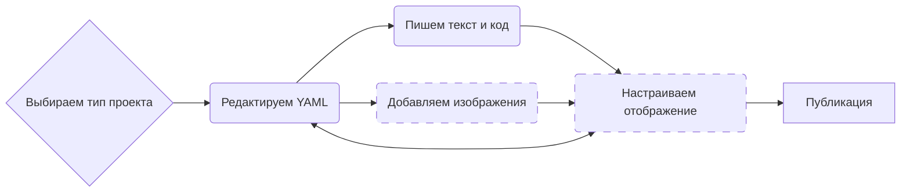

Система Quarto.

<!--more-->




## <span class="section-num">1</span> Общая информация {#общая-информация}

-   Сайт: <https://quarto.org/>
-   Репозиторий: <https://github.com/quarto-dev/quarto-cli>
-   Quarto — это современная система для создания научной, технической и прочей документации.
-   Входной язык: Markdown.
-   Выходные форматы: html, pdf, epub, docx, презентации в формате reveal.js.
-   Интеграция с языками программирования: R, Python, Julia, Observable JS.
    -   Интеграция как в babel (см. [Emacs. Org Babel]()) или julyter.
    -   Позволяет включать в документы интерактивные элементы, такие как виджеты и динамические визуализации.


## <span class="section-num">2</span> Установка {#установка}


### <span class="section-num">2.1</span> Windows {#windows}

-   Chocolatey (см. [Пакетный менеджер для Windows. Chocolatey]()):
    ```shell
    choco install quarto
    ```


### <span class="section-num">2.2</span> Linux {#linux}


#### <span class="section-num">2.2.1</span> Linux в общем {#linux-в-общем}

-   Установка с помощью скрипта:
    ```shell
    #!/bin/bash

    ## Система
    TARGET=/opt
    TARGET_BIN=/usr/local/bin
    ## Домашний каталог
    # TARGET=~/opt
    # TARGET_BIN=~/.local/bin


    ## Получить тег
    TAG=`basename $(curl -sL -o /dev/null -w %{url_effective} https://github.com/quarto-dev/quarto-cli/releases/latest)`
    TAG=${TAG/v/}

    ## Скачать
    cd /tmp
    wget https://github.com/quarto-dev/quarto-cli/releases/download/v${TAG}/quarto-${TAG}-linux-amd64.tar.gz

    ## Распаковать
    mkdir -p ${TARGET}
    tar -C ${TARGET} -xvzf /tmp/quarto-${TAG}-linux-amd64.tar.gz
    mv ${TARGET}/quarto-${TAG} ${TARGET}/quarto

    ## Симлинк на исполняемый файл
    mkdir -p ${TARGET_BIN}
    ln -s ${TARGET}/quarto/bin/quarto ${TARGET_BIN}/quarto
    ```


#### <span class="section-num">2.2.2</span> Gentoo {#gentoo}

-   Gentoo, репозиторий karma (см. [Gentoo. Репозиторий karma]()):
    ```shell
    emerge quarto
    ```


#### <span class="section-num">2.2.3</span> Arch {#arch}

-   Arch linux:
    ```shell
    pacman -S quarto-cli-bin
    ```
-   Manjaro linux:
    ```shell
    pamac install quarto-cli-bin
    ```


#### <span class="section-num">2.2.4</span> Fedora {#fedora}

-   Установка из CORP:
    ```shell
    sudo dnf -y copr enable iucar/rstudio
    sudo dnf -y install quarto
    sudo dnf -y install libxcrypt-compat
    ```


## <span class="section-num">3</span> Установка модулей {#установка-модулей}

-   Установка tinytex:
    ```shell
    quarto install tinytex
    ```


## <span class="section-num">4</span> Общий алгоритм работы {#общий-алгоритм-работы}




## <span class="section-num">5</span> Использование {#использование}

-   [Quarto. Язык markdown]()
-   [Quarto. Оформление метаданных]()
-   [Quarto. Цитирование]()
-   [Quarto. Перекрёстные ссылки]()
-   [Quarto. Структура для книги]()
-   [Quarto. Формат pdf]()
-   [Quarto. Листинги]()
-   [Quarto. Таблицы]()
-   [Quarto. Плагины]()
-   [Quarto. Профили]()
-   [Quarto. Подключение файлов]()


## <span class="section-num">6</span> Ресурсы {#ресурсы}

-   Набор шаблонов для дипломов: <https://github.com/Jupyter4Science/awesome-quarto-thesis>
