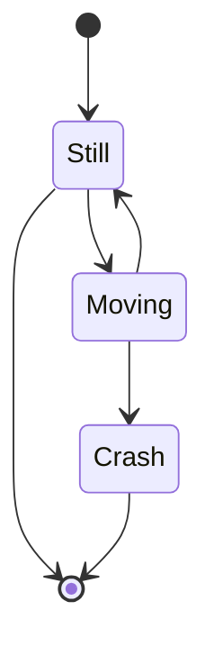

В данном случае описывается вариант Markdown для шаблона [Wowchemy](https://wowchemy.com/), набор операторов которой несколько шире, чем в стандартном [Hugo](https://gohugo.io/).

<!--more-->




## Основные элементы текста {#основные-элементы-текста}


### Заголовки {#заголовки}

```markdown
## Heading 2
### Heading 3
#### Heading 4
##### Heading 5
###### Heading 6
```

Максимальным уровнем заголовка поста является заголовок второго уровня (это не более, чем конвенция).


### Шрифтовые выделения {#шрифтовые-выделения}

```markdown
_Курсив_ - подчёркивания.
**Полужирный** - двойная звёздочка.
Можно объединить: **звёздочки и  _подчёркивания_**.
Для зачёркивания используем ~~двойную тильду~~.
```


### Списки {#списки}


#### Нумерованные {#нумерованные}

```markdown
1. First item
2. Another item
```


#### Ненумерованные {#ненумерованные}

```markdown
* First item
* Another item
```


#### Списки с отметками {#списки-с-отметками}

```markdown
- [x] Write math example
- [x] Write diagram example
- [ ] Do something else
```

Для интерактивности списка с отметками необходима поддержки со стороны хостера.


### Встраивание документов {#встраивание-документов}

В страницу могут быть встроены документы Google.
Чтобы встроить документы Google (например, презентацию):

-   нажмите `Файл -> Опубликовать в Интернете -> Встраивать в Документы Google`;
-   скопируйте URL-адрес в отображаемом атрибуте `src="..."`;
-   вставьте URL-адрес в форму:

    ```markdown
    
    ```


### Сноски {#сноски}

Используются сноски Markdown:

```markdown
Кроме того [^1], …

[^1]: Текст сноски.
```

Кроме того [^1], …

[^1]: Текст сноски.


## Изображения {#изображения}


### Одиночные изображения {#одиночные-изображения}

Статические изображения по-умолчанию подгружаются из каталога
`assets/images/`.

-   Можно подключать изображение с помощью стандартного оператора `markdown`:

    ```markdown
    
    ```

-   Наряду со стандартной загрузкой изображений можно использовать и
    следующую конструкцию:

    ```markdown
    
    ```

-   Изображение можно помещать в папку страницы:

    ```markdown
    
    ```

-   Можно вставлять нумерованные рисунки:

    ```markdown
    
    ```

    С оператором `figure` используется библиотека `fancybox` для
    отображения картинок.


### Галерея изображений {#галерея-изображений}


#### В папке `assets/images/` {#в-папке-assets-images}

-   Добавить изображения в подпапку папки `assets/images/`.
-   Описать все изображения в заголовке поста:

<!--listend-->

```yaml
gallery_item:
  - album: gallery
    image: boards.jpg
    caption: A caption
  - album: gallery
    image: https://<url to image>
    caption: Another caption
```

-   Для отображения галереи на странице вставить оператор

<!--listend-->

```markdown

```


#### В папке страницы {#в-папке-страницы}

-   Создать папку с изображениями внутри папки страницы.
-   Для отображения галереи на странице вставить оператор

<!--listend-->

```markdown

```

-   Дополнительно можно описать изображения в заголовке поста:

<!--listend-->

```yaml
gallery_item:
  - album: <album_folder>
    image: <image_name>.jpg
    caption: Image caption
```

Следует заметить, что для страниц типа `doc` возможно размещение галереи только в папке `assets/images/`.


### Диаграммы {#диаграммы}

Как обычно для Markdown поддерживается расширение для рисования
диаграмм [mermaid](https://mermaid-js.github.io/mermaid/) (см. [Диаграммы. Mermaid]()). Для использования нужно
включить эту функцию в файле `params.toml` или добавив `diagram: true`
в преамбуле страницы.

Например, следующий код

````markdown

````

преобразуется в


### Графики {#графики}

Поддерживает библиотека [Plotly](https://plot.ly/). Для отрисовки графика следует сохранить файл Plotly в формате json в папке страницы.
Например, если файл называется `chart.json`, то он отрисовывается следующим оператором:

````markdown

````

Для создания файла json можно использовать онлайн редактор [Plotly JSON Editor](http://plotly-json-editor.getforge.io/).


## Мультимедийные данные {#мультимедийные-данные}


### Аудио {#аудио}

Подключение аудио поддерживается для локальных MP3-файлов:

````markdown

````

Путь к файлу задаётся от `static/media/`.


### Видео {#видео}


#### Локальные файлы {#локальные-файлы}

-   Подключение видео из `static/media/`:

<!--listend-->

````markdown

````

-   Подключение видео из папки страницы:

<!--listend-->

````markdown

````


#### Youtube {#youtube}

Видео, размещённое на Youtube:

````markdown

````


#### Vimeo {#vimeo}

Видео, размещённое на Vimeo:

````markdown

````


## Ссылки {#ссылки}


### Стандартные ссылки {#стандартные-ссылки}

Можно использовать стандартный формат ссылок Markdown:

````markdown
[I'm a link](https://www.google.com)
````


### Генерация ссылок {#генерация-ссылок}

Ссылки модно генерить с помощью операторов `ref` и `relref`:

````markdown











````

`ref` задаёт абсолютную ссылку, `relref` --- относительную.

Эти ссылки можно использовать внутри стандартных ссылок Markdown:

````markdown
[A post]()
[A publication]()
[A project]()
[A relative link from one post to another post]()
[Scroll down to a page section with heading *Hi*](#hi)
````


#### Ссылка на версию на другом языке {#ссылка-на-версию-на-другом-языке}

Чтобы создать ссылку на версию документа на другом языке, используйте следующий синтаксис:

````markdown

````


#### Другой формат вывода {#другой-формат-вывода}

Чтобы сослаться на другой формат вывода:

````markdown

````


#### Идентификаторы заголовков {#идентификаторы-заголовков}

Для документов markdown Hugo генерирует идентификаторы элементов для каждого заголовка на странице.
Например, для кода

````markdown
## Reference
````

создаётся следующий HTML:

````html
<h2 id="reference">Reference</h2>
````

Ссылку можно задать следующим образом:

````markdown


````

Идентификатор можно задать и явно:

````markdown
## Reference A {#foo}
## Reference B {id="bar"}
````


### Ссылка на статический файл {#ссылка-на-статический-файл}

Ссылка на файл из иерархии `static/`, обычно размещаемый в подкаталоге `static/files/`:

````markdown
Download my CV
````

Опция `newtab` для открытия файла в новой вкладке.


### Цитирование {#цитирование}

Цитирование страницы (ссылка на папку страницы):

````markdown

````

Опция `view` задаёт один из стандартных форматов:

-   Stream,
-   Compact (установлен по умолчанию),
-   Card,
-   Параметр устанавливается согласно `citation_style` из `params.toml`.


## Специальные элементы {#специальные-элементы}


### Содержание страницы (Table of Contents) {#содержание-страницы--table-of-contents}

Содержание страницы задаётся с помощью следующего оператора:

````markdown

````

Уровни заголовков, попадающие в содержание, задаются в `config.toml`

````toml
[markup.tableOfContents]
   endLevel = 3
   ordered = false
   startLevel = 2
````

Как видно, содержание начинается со второго уровня (это соответствует
соглашению об уровнях заголовков), а завершается третьим. При
необходимости следует внести изменения.


### Отбивка резюме (Summary Splitter) {#отбивка-резюме--summary-splitter}

Отбивка резюме задаётся конструкцией

````html
<!--more-->
````


## Backlinks {#backlinks}

-   [Синтаксис языка Markdown]()

<!--listend-->

-   [Генератор статических сайтов Hugo]()

<!--listend-->

-   [Org-mode. Экспорт в Hugo]()
