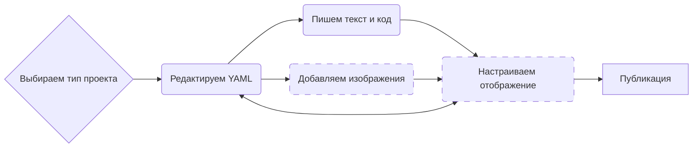

Система Quarto.

<!--more-->




## <span class="section-num">1</span> Общая информация {#общая-информация}

-   Сайт: <https://quarto.org/>
-   Репозиторий: <https://github.com/quarto-dev/quarto-cli>
-   Quarto — это современная система для создания научной, технической и прочей документации.
-   Входной язык: Markdown.
-   Выходные форматы: html, pdf, epub, docx, презентации в формате reveal.js.
-   Интеграция с языками программирования: R, Python, Julia, Observable JS.
    -   Интеграция как в babel (см. [Emacs. Org Babel]()) или julyter.
    -   Позволяет включать в документы интерактивные элементы, такие как виджеты и динамические визуализации.


## <span class="section-num">2</span> Установка {#установка}

-   Gentoo, репозиторий karma (см. [Gentoo. Репозиторий karma]()):
    ```shell
    emerge quarto
    ```


## <span class="section-num">3</span> Общий алгоритм работы {#общий-алгоритм-работы}




## <span class="section-num">4</span> Использование {#использование}

-   [Quarto. Язык markdown]()
-   [Quarto. Оформление метаданных]()
-   [Quarto. Цитирование]()
-   [Quarto. Перекрёстные ссылки]()
-   [Quarto. Структура для книги]()
-   [Quarto. Формат pdf]()
